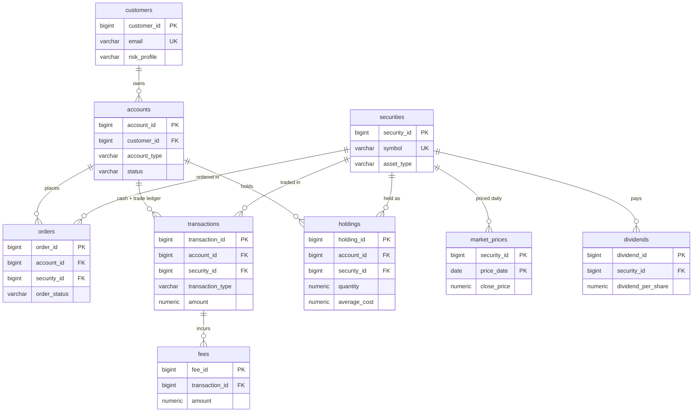

# ER diagram

```mermaid
erDiagram
    customers ||--o{ accounts : owns
    accounts  ||--o{ orders : places
    accounts  ||--o{ transactions : "cash + trade ledger"
    accounts  ||--o{ holdings : holds
    securities ||--o{ orders : "ordered in"
    securities ||--o{ transactions : "traded in"
    securities ||--o{ holdings : "held as"
    securities ||--o{ market_prices : "priced daily"
    securities ||--o{ dividends : pays
    transactions ||--o{ fees : incurs

    customers { bigint customer_id PK
        varchar email UK
        varchar risk_profile }
    accounts { bigint account_id PK
        bigint customer_id FK
        varchar account_type
        varchar status }
    securities { bigint security_id PK
        varchar symbol UK
        varchar asset_type }
    orders { bigint order_id PK
        bigint account_id FK
        bigint security_id FK
        varchar order_status }
    transactions { bigint transaction_id PK
        bigint account_id FK
        bigint security_id FK
        varchar transaction_type
        numeric amount }
    holdings { bigint holding_id PK
        bigint account_id FK
        bigint security_id FK
        numeric quantity
        numeric average_cost }
    market_prices { bigint security_id PK
        date price_date PK
        numeric close_price }
    dividends { bigint dividend_id PK
        bigint security_id FK
        numeric dividend_per_share }
    fees { bigint fee_id PK
        bigint transaction_id FK
        numeric amount }
```
